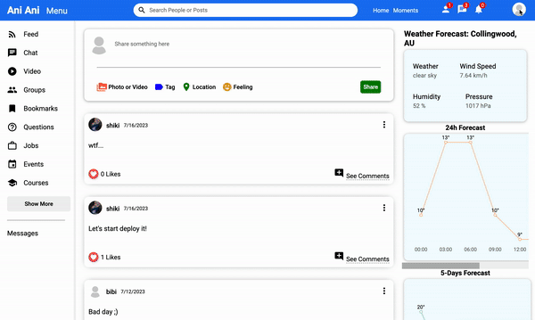

# Introduction
This is a social website. Please use Chrome to get the full experience.

The weather API is expired. Please purchase it here: https://rapidapi.com/worldapi/api/open-weather13

## Available Features:
1. Register new users
2. Log in
3. Add posts
4. Like posts
5. Add comments to a posts
6. Weather Forecast of user's location
7. Upload user icon
8. Change user info
9. Follow / Unfollow a user
10. Top bar can show the notifications of new following users
11. Search bar can find users by entering username or partial letters of the username

## Features Showcases:
1. Register, Log in, Log out


2. Update user icon and info



3. Write post, Like post, Add comment


4. Click other user icon, Access their profile page, Follow them, Receive new follower notification


5. Search other username, Access their profile page, Unfollow them


# User Manual

## Localhost Deploy
##### Start Frontend Server
`cd client`

`npm install`

`npm start`

Modify `.env` to update backend url and open weather API key.
##### Start Backend Server
`cd server`

`npm install`

`npm start`

Modify `config.env` to update backend port and MongoDB database address.

### MongoDB
##### How to save database
1. Navigate to a directory where you want to store the data.
2. Run `mongodump`. If *dump* exists already, it will be overwrited.
3. To backup a specific database on a specific host: `mongodump --host=mongodb-host:port --db=your-db-name`

##### How to restore database
1. cd to the folder includes `dump` 
2. Run `mongorestore`(default on port 27017)
3. To restore specific database on a specific host: `mongorestore --host mongodb0.example.com --port 27017 --db your_database_name /path/to/your/dump/your_database_name`


## Deploy on Azure Virtual Machine
### Install SSL certificate
1. Buy a domain
2. Set Host records
 ```
 Type          Host         Value         TTL   
 A Record 	    @    Azure_VM_IP_addr   Automatic
 CNAME Record www     Your_domain        Automatic
 ```
3. In Azure VM, set Server's 443 port open for inbound traffic
4. Follow `https://certbot.eff.org/instructions?ws=nginx&os=ubuntufocal` instruction to install SSL certificate on your machine.
5. Remember to record the cert and key files paths.

### Configure NGINX
1. Decide which port to run the servers
2. Write configuration
```
server {
    listen 80;
    server_name aniani.cfd;

    location / {
        proxy_pass http://localhost:3000;
        proxy_http_version 1.1;
        proxy_set_header Upgrade $http_upgrade;
        proxy_set_header Connection 'upgrade';
        proxy_set_header Host $host;
        proxy_cache_bypass $http_upgrade;
    }
    
    location /users {
        proxy_pass http://localhost:5000/users;
        proxy_http_version 1.1;
        proxy_set_header Upgrade $http_upgrade;
        proxy_set_header Connection 'upgrade';
        proxy_set_header Host $host;
        proxy_cache_bypass $http_upgrade;
    }
}

// When listening port 443, add paths for the ssl cert and key that retrieved from last section.

server {
    listen 443 ssl;
    server_name aniani.cfd;

    ssl_certificate /etc/letsencrypt/live/aniani.cfd/fullchain.pem;
    ssl_certificate_key /etc/letsencrypt/live/aniani.cfd/privkey.pem;
    include /etc/letsencrypt/options-ssl-nginx.conf;
    ssl_dhparam /etc/letsencrypt/ssl-dhparams.pem;

    location / {
        proxy_pass http://localhost:3000;
        proxy_http_version 1.1;
        proxy_set_header Upgrade $http_upgrade;
        proxy_set_header Connection 'upgrade';
        proxy_set_header Host $host;
        proxy_cache_bypass $http_upgrade;
    }

    location /users {
        proxy_pass http://localhost:5000/users;
        proxy_http_version 1.1;
        proxy_set_header Upgrade $http_upgrade;
        proxy_set_header Connection 'upgrade';
        proxy_set_header Host $host;
        proxy_cache_bypass $http_upgrade;
    }
}
```
1. Create and write your configuration file: `sudo nano /etc/nginx/sites-available/myapp`.
2. Create symbolic link: `sudo ln -s /etc/nginx/sites-available/myapp /etc/nginx/sites-enabled/`
3. Test conf: `sudo nginx -t`
4. Restart Nginx: `sudo systemctl reload nginx` or `sudo systemctl restart nginx`
5. If have default conf, you can remove it: `sudo rm /etc/nginx/sites-enabled/default`

### Use PM2 to host your website persistently
The VM may shut down the server processes.
Use PM2 to restart the processed when they are down.

Since we are using `npm start` to run our server, we can run:
`pm2 start npm --name client -- run start`
To let pm2 run our start script.

To monitor all pm2 processes, run: 
`pm2 list`

To delete pm2 process, run:
`pm2 delete id`
