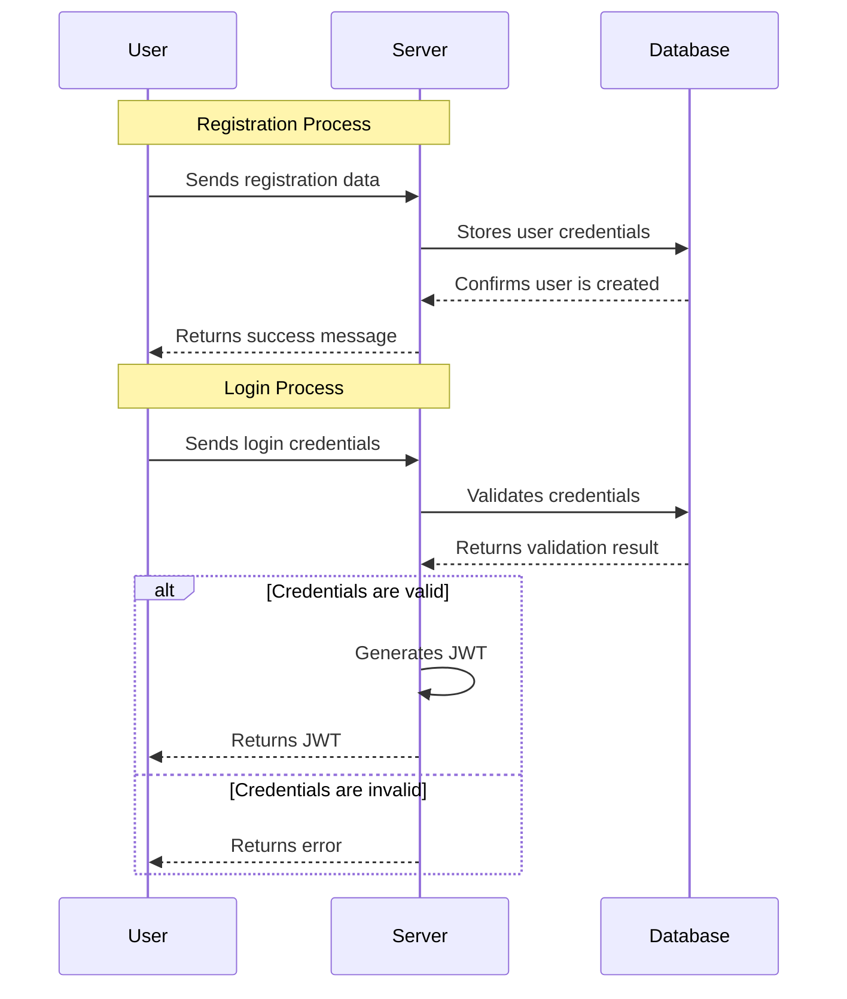
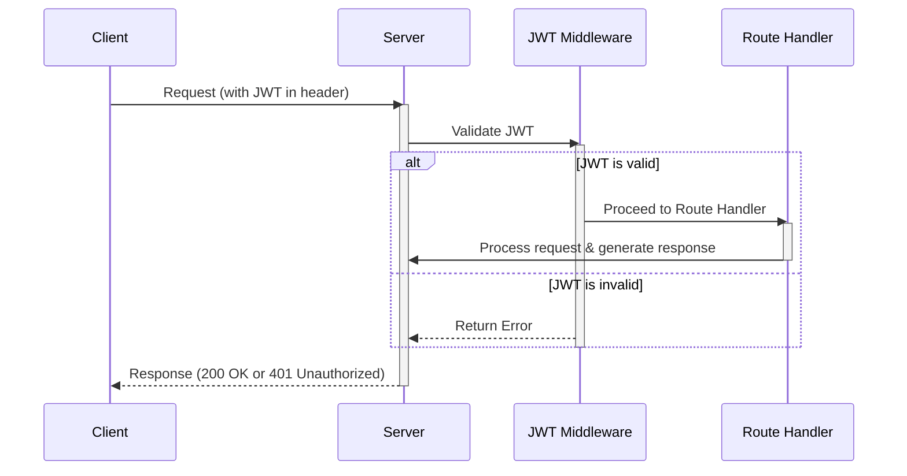

# Authentication Design
## Auth Architecture

## Implementation
To implement JWT functionality, especially in the context of a web application using a middleware approach, is a common and effective strategy. The middleware will intercept incoming requests, extract and validate the JWT, and then either allow the request to proceed to the next stage or reject it if the token is invalid.

### Explanation

1. **User Registration and Login**:
   - During registration, user details are stored in the database, and upon successful login, a JWT is generated and sent back to the user.
   - The JWT typically includes a payload with user information and a signature to ensure its authenticity.

2. **JWT Middleware**:
   - The JWT middleware is a function that runs between the incoming request and the route handler.
   - It checks for the presence of a JWT in the request headers and validates it.
   - If the token is valid, the middleware sets the user context for the request and passes control to the next handler.
   - If the token is invalid (expired, tampered with, etc.), the middleware stops the request, and an error response is sent back to the client.

3. **Protected Routes**:
   - Only requests with a valid JWT can access protected routes. If the JWT is missing or invalid, the middleware prevents access.

### Implementation Steps

1. **Install JWT Library**: Use a JWT library suitable for your programming language and framework.
2. **Generate JWT on Login**: After validating user credentials during the login process, generate a JWT and send it to the client.
3. **Create Middleware Function**:
   - Extract the JWT from the request headers.
   - Validate the JWT using the secret key used to sign the token.
   - If valid, allow the request to proceed; if not, return an error response.
4. **Apply Middleware to Protected Routes**: Configure your application routes to use the JWT middleware for any route that requires authentication.

### Mermaid Diagram

Here’s a Mermaid diagram to illustrate the JWT process with middleware:

In this diagram:

- **Client**: Sends requests to the server and receives responses. The client stores and includes the JWT in the headers of requests to protected routes.
- **Server**: The main application server that receives all requests.
- **JWT Middleware**: Intercepts requests, checks and validates the JWT.
- **Route Handler**: The final destination of the request if the JWT is valid, where actual business logic is processed.

By integrating the JWT functionality as middleware, you create a centralized and consistent way to handle authentication across your application, making the codebase cleaner and more maintainable.