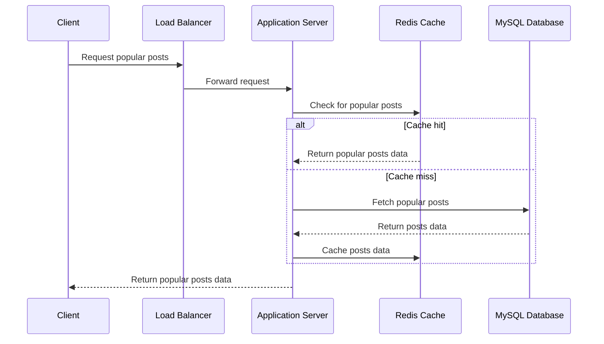

# Post Model Design
To transition the post data schema from MongoDB to MySQL and efficiently use Redis for caching popular posts, we can follow these steps:

### MySQL Post Schema
First, define the MySQL schema for storing posts. Since the `img` field refers to the user's profile picture, we can link it to the `userId` or `profilePictureId` in the `User` table instead of storing the image directly in the `Post` table.

```plaintext
| Field            | Type     | Constraints                 | Description                         |
| ---------------- | -------- | --------------------------- | ----------------------------------- |
| postId           | Integer  | Primary Key, Auto Increment | Unique identifier for the post.     |
| uid              | String   | Foreign Key (userId)        | Link to the user's ID.              |
| username         | String   |                             | The username of the post creator.   |
| desc             | String   | Max Length: 500             | A description of the post.          |
| profilePictureId | String   | Optional, Foreign Key       | Link to the user's profile picture. |
| createdAt        | DateTime |                             | The creation date of the post.      |
| updatedAt        | DateTime |                             | The update date of the post.        |
```

The `profilePictureId` can be used to fetch the profile picture URL from MinIO whenever needed, instead of storing the image or its URL in the `Post` schema.

### Redis for Popular Posts
For caching popular posts in Redis, consider these criteria:

- A post is considered popular if it has a number of likes above a certain threshold. This threshold can be determined based on average likes or a predefined number.
- Store the entire post object in Redis, including necessary details like `postId`, `desc`, `username`, and `likes`.
- Use a sorted set or a priority queue in Redis to keep the posts ordered by their popularity (like count).

#### Redis Schema

```plaintext
| Key             | Type | Description                      |
| --------------- | ---- | -------------------------------- |
| `popular_posts` | ZSet | Post IDs sorted by like count.   |
| `post:<postId>` | Hash | Complete data of a popular post. |
```

- `popular_posts`: A sorted set (ZSet) where each entry's score is the like count, and the member is the post ID. This sorted set helps identify the most popular posts.
- `post:<postId>`: A hash storing the complete data for each popular post, where `<postId>` is the unique identifier for the post. This hash can include fields like `username`, `desc`, `profilePictureId`, `createdAt`, and `updatedAt`.

### Caching Strategy

1. **Post Likes Update**: When a post's like count is updated, check if it exceeds the popularity threshold.
2. **Caching Popular Posts**:
   - If the post qualifies as popular, fetch its complete data from MySQL.
   - Store this data in Redis under `post:<postId>`.
   - Update the `popular_posts` sorted set with the post ID and its new like count.
3. **Accessing Popular Posts**:
   - To access popular posts, first query the `popular_posts` sorted set in Redis.
   - Retrieve the complete post data from the `post:<postId>` hash in Redis.
   - If the post data is not in Redis (e.g., cache miss), fetch it from MySQL and update the Redis cache accordingly.

### Implementation Notes

- **Cache Maintenance**: Regularly update the cache to reflect changes in post popularity and content. Set an appropriate time-to-live (TTL) for each cached post to ensure the cache stays fresh and relevant.
- **Background Synchronization**: Implement background processes to sync Redis with MySQL data, particularly for updating like counts and adding or removing posts from the cache based on their popularity.

By storing complete post data in Redis for popular posts, we can significantly reduce the load on the MySQL database and provide faster access to frequently requested data, enhancing the overall performance and scalability of the application.

# Scenarios

### Reading popular posts from the database and caching them in Redis for faster access:



#### Explanation of the Flow:

1. **Client Request**: The client requests popular posts, which goes to the load balancer.
2. **Load Balancer**: Forwards the request to the application server.
3. **Application Server Checks Redis**:
   - The server first checks Redis to see if the popular posts are cached.
4. **Cache Hit**:
   - If the popular posts are in the Redis cache (cache hit), Redis returns the posts data to the server.
5. **Cache Miss**:
   - If the data is not in the cache (cache miss), the server fetches the popular posts from the MySQL database.
6. **MySQL Database**: Returns the requested posts data to the server.
7. **Caching**: The server caches the posts data in Redis for future requests.
8. **Client Response**: Finally, the server returns the popular posts data to the client.
