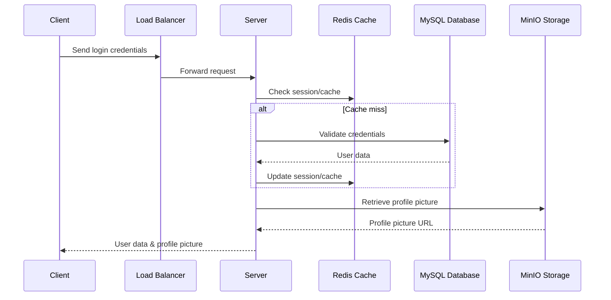
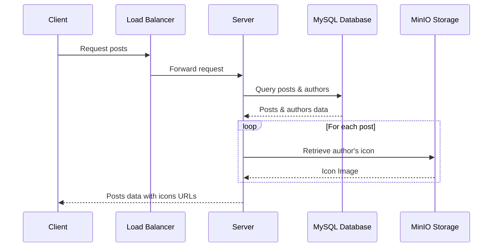

# User Model Design

## Overview

The User model represents the individuals who use the application, containing their personal information, credentials, and references to their profile pictures stored in MinIO.

### Schema Definition

#### MySQL Schema

| Field            | Type    | Constraints                 | Description                                       |
| ---------------- | ------- | --------------------------- | ------------------------------------------------- |
| userId           | Integer | Primary Key, Auto Increment | Unique identifier for the user.                   |
| username         | String  | Required, Unique            | The user's unique username.                       |
| email            | String  | Required, Unique            | The user's email address.                         |
| password         | String  | Required                    | The user's hashed password.                       |
| profilePictureId | String  | Optional                    | Reference to the user's profile picture in MinIO. |
| desc             | String  | Max Length: 50              | A short description of the user.                  |
| age              | Integer | Min: 0, Max: 200            | The user's age.                                   |
| from             | String  | Max Length: 20              | The user's origin.                                |
| isAdmin          | Boolean |                             | Whether the user is an admin.                     |

#### Redis Schema

| Field           | Type     | Description                              |
| --------------- | -------- | ---------------------------------------- |
| userId          | String   | Reference to `userId` in MySQL           |
| followersCount  | Integer  | Count of followers; updated dynamically  |
| followingsCount | Integer  | Count of followings; updated dynamically |
| lastActive      | DateTime | Timestamp of the user's last activity    |
| sessionData     | Hash     | User's current session information       |

#### File Storage (MinIO)

| Field            | Type    | Description                              |
| ---------------- | ------- | ---------------------------------------- |
| profilePictureId | String  | Unique identifier for the image in MinIO |
| filePath         | String  | Path or URL to access the image in MinIO |
| mimeType         | String  | The MIME type of the image               |
| size             | Integer | The size of the image file in bytes      |

#### Process Flow

1. **User Registration/Login**: Store user credentials and other metadata in MySQL.
2. **Profile Picture Upload**:
   - Upload the image file to MinIO.
   - Store the reference ID (`profilePictureId`), and access path (`filePath`) in the MySQL `User` table.
3. **Access Control**: Use the application logic to manage who can upload, view, or delete images.
4. **Redis Usage**:
   - Cache frequently accessed data like `followersCount`, `followingsCount`, and `lastActive` in Redis.
   - Manage session data in Redis for quick access and state management.

This redesign leverages MinIO for efficient large file storage while using MySQL for structured data and metadata, and Redis for high-performance data access and caching. This setup ensures scalability, efficient data retrieval, and effective management of user information and assets.

# How this architecture works?
**Note: Load Balancing** distribute incoming client requests across multiple server instances to prevent any single instance from being overloaded.
### Scenario 1: Client Login and Retrieve Own User Information and Icon

In this scenario:

1. The Client sends login credentials to the Server.
2. The Server validates these credentials against the MySQL Database.
3. Upon successful validation, the Server checks Redis for any cached session data.
4. The Server then retrieves the user’s profile picture from MinIO.
5. Finally, the Server returns the user data along with the profile picture URL to the Client.

### Scenario 2: Browsing User Posts with Author's Icon

In this scenario:

1. The Client requests to view posts from the Server.
2. The Server queries the MySQL Database for posts and their respective author details.
3. For each post, the Server retrieves the author's profile picture from MinIO.
4. The Server then sends the posts data, including the URLs of the authors’ profile pictures, back to the Client.

Separating the diagrams helps to clearly distinguish the processes involved in each scenario, making it easier to understand the flow of interactions.
