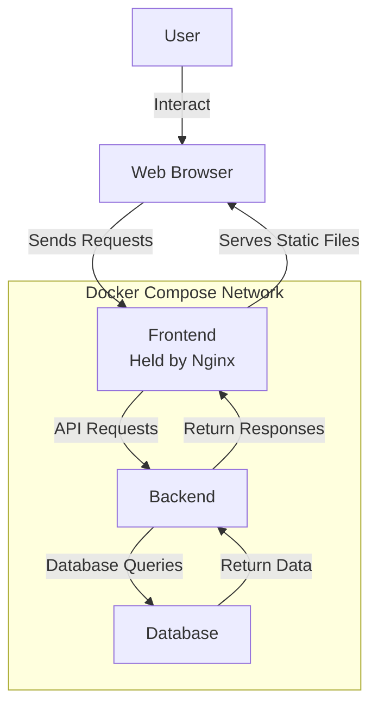

# Architecture Overview

```mermaid
flowchart TD
    A[User] -- " Interact " --> B[Web Browser]
    B -- " Sends Requests " --> C[Frontend <br> Held by Nginx]
    C -- " Serves Static Files " --> B
    C -- " API Requests " --> D[Backend]
    D -- " Return Responses " --> C
    D -- " Database Queries " --> E[Database]
    E -- " Return Data " --> D

    subgraph Docker Compose Network
        C
        D
        E
    end
```