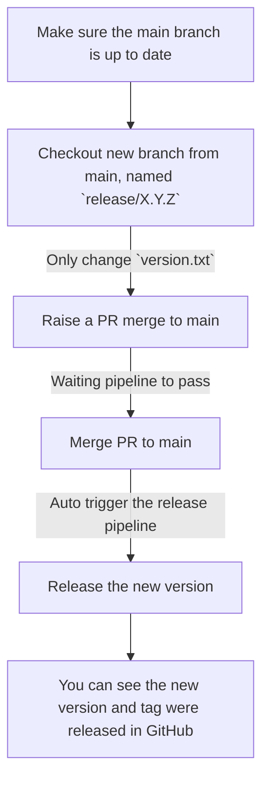

# How to release new version?

```mermaid
flowchart
    A[Make sure the main branch is up to date] --> B[Checkout new branch from main, named `release/X.Y.Z`]
    B -- "Only change `version.txt`" --> C[Raise a PR merge to main]
    C -- "Waiting pipeline to pass" --> D[Merge PR to main]
    D -- "Auto trigger the release pipeline" --> E[Release the new version]
    E --> F[You can see the new version and tag were released in GitHub]
```